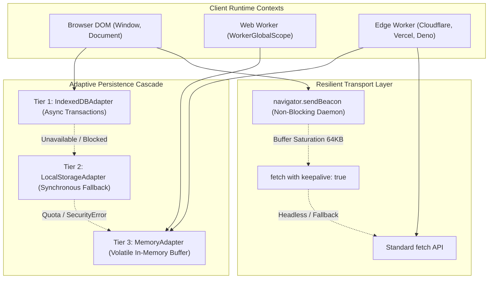
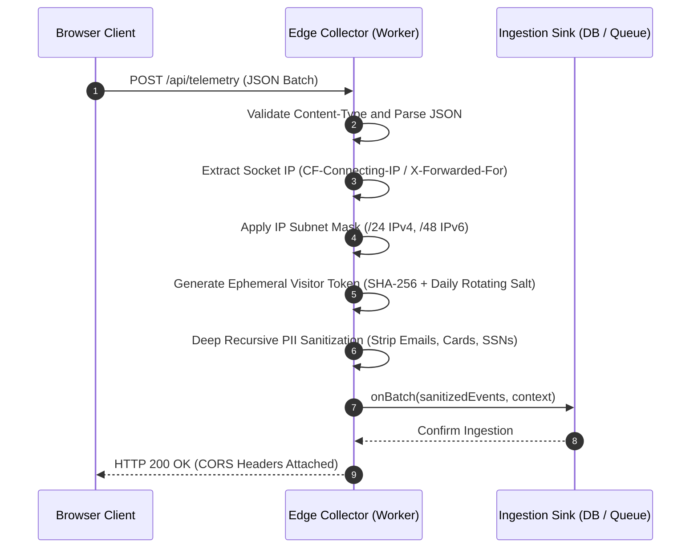

# Technical Architecture & System Design

`micro-attribution` is an enterprise-grade, zero-dependency client and edge telemetry engine engineered for privacy-preserving conversion attribution.

This document details the internal runtime topology, sub-pixel monotonic time generator, 3-tier adaptive storage hierarchy, backpressure quota engine, resilient network transport dispatcher, and edge ingestion pipeline.

---

## 1. Dual-Runtime Topology

Modern web applications execute across heterogeneous environments with vastly divergent API availabilities: desktop browsers with full DOM and IndexedDB, mobile browsers with aggressive battery throttling and process killing, Web Workers without DOM access, and edge serverless runtimes (Cloudflare Workers, Vercel Edge, Deno, Node.js) with zero DOM and zero persistent client disk storage.

`micro-attribution` handles this divergence through dynamic runtime capability detection and graceful degradation across all subsystems:

---

## 2. Monotonic Clock & Sub-Pixel Precision

Attribution models depend on strict chronological sequencing. Standard wall-clock timestamps (`Date.now()`) suffer from NTP clock skew, daylight saving adjustments, and manual user clock edits, causing touchpoint events to appear out of order.

The `MonotonicClock` class ([src/utils/clock.ts](file:///Users/mike/Documents/micro-attribution/micro-attribution/src/utils/clock.ts)) eliminates chronological distortion by pairing a fixed wall-clock epoch origin with high-resolution monotonic elapsed time:

$$\text{Timestamp}(t) = T_{\text{origin}} + \Delta_{\text{mono}}(t)$$

Where:
- $T_{\text{origin}}$ is captured once during clock initialization via `Date.now()`.
- $\Delta_{\text{mono}}(t)$ is derived from `performance.now()`, providing sub-millisecond precision.
- A monotonic ratchet guard enforces that $\text{Timestamp}(t_{k+1}) \ge \text{Timestamp}(t_k)$ under all conditions, preventing backwards time travel.

---

## 3. 3-Tier Storage Hierarchy & Backpressure Management

Client storage availability is inherently volatile. Users browse in Safari Private Browsing mode, disable cookies and local storage, or exhaust device storage space.

### 3.1 Adaptive Storage Cascade
The `createAdaptiveStorage()` factory probes capabilities in order of durability:
1. **Tier 1 (`IndexedDBAdapter`)**: Uses asynchronous object stores with an index on `timestamp`. Handles concurrent multi-tab access, isolated transactions, and large volume storage.
2. **Tier 2 (`LocalStorageAdapter`)**: Activated when IndexedDB is blocked or disabled. Stores a serialized JSON queue protected by defensive try-catch blocks and automated corrupted-record filtering.
3. **Tier 3 (`MemoryAdapter`)**: High-throughput volatile map utilized in headless edge runtimes, SSR rendering, or when all browser storage APIs throw security exceptions.

### 3.2 Backpressure & Priority-Aware FIFO Eviction
The `EventQueue` class ([src/queue/event-queue.ts](file:///Users/mike/Documents/micro-attribution/micro-attribution/src/queue/event-queue.ts)) manages a bounded queue to prevent storage bloat or memory exhaustion during prolonged offline states:
- Maximum Event Count Cap: $N_{\max} = 1000$ events.
- Maximum Byte Size Limit: $S_{\max} = 2 \text{ MB}$.
- **Priority-Aware Eviction Algorithm**:
  1. When an incoming event exceeds available capacity, the queue scans for the oldest event with `priority: 'normal'` (e.g. pageviews or clicks).
  2. The oldest normal event is dropped via FIFO eviction, updating cumulative byte sizes and firing the `onDrop` callback.
  3. High-priority events (e.g. monetary conversions and purchases) are strictly protected and never evicted while normal events remain.
  4. If storage throws a `QuotaExceededError` DOMException, `EventQueue.enqueue` catches the error, performs emergency eviction of normal records, and retries persistence.

---

## 4. Network Transport & Resilient Delivery Engine

### 4.1 Transport Auto-Negotiation
The `transmitBatch()` function negotiates the optimal transport mechanism:
- **`navigator.sendBeacon`**: Best for page teardown, app minimization, and tab closure. Enqueues payloads into the browser network daemon without blocking page navigation.
- **`fetch(..., { keepalive: true })`**: Secondary fallback when `sendBeacon` returns `false` due to the browser 64 KB beacon buffer ceiling.
- **Standard `fetch`**: Universal fallback for Web Workers, Node.js, and serverless edge environments.

### 4.2 Lifecycle Unload Flusher
The unload flusher ([src/transport/flusher.ts](file:///Users/mike/Documents/micro-attribution/micro-attribution/src/transport/flusher.ts)) listens to:
- `visibilitychange` when `document.visibilityState === 'hidden'`.
- `pagehide` on `window`.

Deprecated `unload` and `beforeunload` events are intentionally avoided to ensure compatibility with modern browser Back/Forward Cache (bfcache).

### 4.3 Truncated Exponential Backoff with Full Jitter
To prevent thundering herds on edge ingestion endpoints during mass reconnections, retry intervals are calculated using full jitter:

$$t_{\text{sleep}}(r) \sim \mathcal{U}\left(0, \min\left(M, B \cdot 2^r\right)\right)$$

Where $B = 1000 \text{ ms}$, $M = 30000 \text{ ms}$, and $r$ is the consecutive failure attempt counter.

When servers respond with an RFC 7231 `Retry-After` header (either in delay-seconds or IMF-fixdate format), the dispatcher pauses outgoing requests for the requested interval before resuming.

---

## 5. Edge Ingestion Pipeline & Privacy Sanitization

The `handleEdgeRequest()` handler ([src/edge/collector.ts](file:///Users/mike/Documents/micro-attribution/micro-attribution/src/edge/collector.ts)) executes in stateless serverless environments:

### Statutory Privacy Compliance
- **Zero Third-Party Cookies**: Conversion stitching is executed without setting third-party or tracking cookies.
- **Ephemeral Salt Rotation**: Visitor pseudonyms are generated using HMAC-SHA256 with a salt rotated daily at UTC midnight ($S_d = \text{SHA-256}(K_{\text{secret}} \parallel \text{YYYY-MM-DD})$). This ensures intraday session stitching while making longitudinal cross-day tracking cryptographically impossible.
- **Subnet Masking**: Client IP addresses are truncated before downstream logging: IPv4 addresses have their host octet zeroed (`192.168.1.0/24`), and IPv6 addresses have their interface identifier masked (`2001:db8:85a3::/48`).
