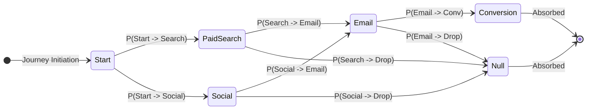

# Multi-Touch Attribution Models & Mathematical Foundations

`micro-attribution` implements a suite of single-touch, heuristic multi-touch, and algorithmic Markov chain attribution models.

This guide provides the mathematical formulas, algorithms, boundary conditions, and recommended business use cases for each model.

---

## 1. Attribution Mathematical Invariants

Every attribution algorithm in `micro-attribution` strictly enforces two fundamental mathematical invariants:

1. **Credit Fraction Normalization**:
   $$\sum_{i=1}^m w_i = 1.0 \pm 10^{-6}$$
   Where $m$ is the count of distinct participating channels and $w_i$ is the credit fraction assigned to channel $i$.

2. **Conversion Value Conservation**:
   $$\sum_{i=1}^m \text{Credit}_i = V$$
   Where $V$ is the total monetary revenue of the conversion event and $\text{Credit}_i = w_i \cdot V$.

---

## 2. Single-Touch Models

### 2.1 First-Touch Attribution (FTA)
Allocates 100% of the conversion credit to the earliest chronological marketing touchpoint in the customer journey.

- **Weight Assignment**:
  $$w_i = \begin{cases} 1.0 & \text{if } i = 1 \text{ (earliest touchpoint)} \\ 0.0 & \text{otherwise} \end{cases}$$
- **Best For**: Top-of-funnel discovery campaigns, brand awareness measurement, and customer acquisition channel evaluation.

### 2.2 Last-Touch Attribution (LTA)
Allocates 100% of the conversion credit to the most recent touchpoint immediately preceding the conversion event.

- **Weight Assignment**:
  $$w_i = \begin{cases} 1.0 & \text{if } i = n \text{ (latest touchpoint)} \\ 0.0 & \text{otherwise} \end{cases}$$
- **Best For**: Bottom-of-funnel retargeting, promotional close campaigns, and high-velocity transactional purchase funnels.

### 2.3 Last Non-Direct Click Attribution
Standardized model used in Google Analytics and ecommerce reporting. It attributes 100% of the credit to the most recent marketing touchpoint, intentionally skipping "direct" navigation unless the entire journey consists exclusively of direct visits.

- **Algorithm**:
  1. Inspect touchpoints in reverse chronological order ($i = n, n-1, \dots, 1$).
  2. If channel matches any direct alias (`direct`, `none`, `typed`, `self`), continue scanning backwards.
  3. Attribute 100% credit to the first non-direct touchpoint discovered.
  4. If all touchpoints in the journey are direct, allocate 100% credit to the final direct visit.

---

## 3. Heuristic Multi-Touch Models

### 3.1 Linear Attribution
Distributes credit uniformly across all touchpoints in the customer journey, reflecting an equal contribution across each engagement.

- **Formula**:
  $$w_i = \frac{1}{n}, \quad \text{for } i \in \{1, \dots, n\}$$
- **Channel Aggregation**:
  $$W_c = \sum_{i \in \text{Touchpoints}(c)} w_i = \frac{|\text{Touchpoints}(c)|}{n}$$
- **Best For**: Extended B2B buyer journeys with prolonged consideration cycles where every marketing touchpoint contributes to relationship nurturing.

### 3.2 Time-Decay Attribution
Recognizes that touchpoints occurring closer in time to the conversion event typically exerted greater influence over the purchase decision. Credit decays exponentially based on elapsed time.

- **Decay Rate Constant**:
  $$\lambda = \frac{\ln(2)}{t_{1/2}}$$
  Where $t_{1/2}$ is the half-life duration (default: 7 days, configurable via `halfLifeDays`).

- **Raw Weight Equation**:
  $$W_{\text{raw}, i} = \exp\left(-\lambda \cdot \frac{t_{\text{conv}} - t_i}{\Delta_{\text{day}}}\right)$$
  Where $t_{\text{conv}}$ is the conversion timestamp, $t_i$ is the touchpoint timestamp, and $\Delta_{\text{day}} = 86,400,000 \text{ ms}$.

- **Normalized Credit**:
  $$w_i = \frac{W_{\text{raw}, i}}{\sum_{j=1}^n W_{\text{raw}, j}}$$
- **Best For**: Promotional sales cycles, limited-time discount campaigns, and competitive retail funnels.

### 3.3 Position-Based / U-Shaped Attribution
Prioritizes the critical discovery touchpoint (first touch) and closing touchpoint (last touch), while evenly distributing remaining credit across all intermediate nurturing interactions.

- **Weight Distribution for $n > 2$**:
  $$w_1 = W_{\text{first}} = 0.40$$
  $$w_n = W_{\text{last}} = 0.40$$
  $$w_i = \frac{W_{\text{middle}}}{n - 2} = \frac{0.20}{n - 2}, \quad \text{for } i \in \{2, \dots, n-1\}$$

- **Boundary Conditions**:
  - $n = 1$: Allocates 100% credit to the single touchpoint ($w_1 = 1.0$).
  - $n = 2$: Splits credit equally between both touchpoints ($w_1 = 0.50, w_2 = 0.50$).
- **Parametric Generalization**:
  Custom weights $(w_{\text{first}}, w_{\text{middle}}, w_{\text{last}})$ can be passed via `options.positionWeights`. The engine automatically normalizes inputs so that $w_{\text{first}} + w_{\text{middle}} + w_{\text{last}} = 1.0$.

---

## 4. Algorithmic Markov Chain Attribution

Heuristic models rely on predetermined arbitrary weight assumptions. The **Markov Chain Attribution Model** uses discrete-time stochastic process mathematics and graph theory to evaluate empirical transition probabilities and calculate the objective marginal contribution of each channel.

### 4.1 State Space Definition
Let the state space $S$ consist of:
- Starting state: $s_{\text{start}}$
- Participating marketing channels: $c_1, c_2, \dots, c_k$ (transient states)
- Absorbing states: $s_{\text{conv}}$ (successful conversion) and $s_{\text{null}}$ (journey abandonment)

### 4.2 Transition Probability Matrix
From empirical cohort journey data, transition frequencies $N(i \to j)$ are tallied between all consecutive states. The transition probability is:

$$P_{i,j} = \frac{N(i \to j)}{\sum_m N(i \to m)}$$

The full matrix is expressed in absorbing canonical form:

$$P = \begin{pmatrix} Q & R \\ 0 & I \end{pmatrix}$$

Where:
- $Q$ is a $k \times k$ matrix of transition probabilities between transient states.
- $R$ is a $k \times 2$ matrix of transition probabilities from transient states to absorbing states ($s_{\text{conv}}$ and $s_{\text{null}}$).
- $I$ is the $2 \times 2$ identity matrix.

### 4.3 Fundamental Matrix & Conversion Probability
The expected number of visits to transient state $j$ starting from $i$ before absorption is given by the fundamental matrix $N$:

$$N = \sum_{m=0}^\infty Q^m = (I - Q)^{-1}$$

The overall probability of conversion starting from state $s_{\text{start}}$ is:

$$P(\text{conversion}) = B_{\text{start}, \text{conv}} = \left[ (I - Q)^{-1} \cdot R \right]_{\text{start}, \text{conv}}$$

`micro-attribution` solves the linear system $(I - Q) x = R_{*, \text{conv}}$ directly using Gaussian elimination with partial pivoting, achieving sub-millisecond execution without requiring external linear algebra libraries.

### 4.4 Removal Effect Calculation
To compute the true incrementality of marketing channel $c$, channel $c$ is computationally removed from the network (all transitions to $c$ divert to $s_{\text{null}}$), and the modified conversion probability $P(\text{conversion} \setminus c)$ is recalculated.

The **Removal Effect** ($RE_c$) quantifies the proportional loss in conversions when channel $c$ is removed:

$$RE_c = \frac{P(\text{conversion}) - P(\text{conversion} \setminus c)}{P(\text{conversion})}$$

### 4.5 Removal Effect Credit Normalization
Final attribution credit is allocated in direct proportion to each channel's removal effect:

$$w_c = \frac{RE_c}{\sum_{j=1}^k RE_j}, \quad \text{Credit}_c = w_c \cdot V_{\text{total}}$$

If a channel's removal has zero effect on the baseline conversion rate ($RE_c = 0$), it receives zero attribution credit.

---

## 5. Model Selection Summary Guide

| Attribution Model | Complexity | Computational Cost | Primary Strategic Purpose |
| :--- | :--- | :--- | :--- |
| **First-Touch** | $O(1)$ | Sub-millisecond | Top-of-funnel customer acquisition and brand awareness |
| **Last-Touch** | $O(1)$ | Sub-millisecond | Bottom-of-funnel conversion closing and transactional funnels |
| **Last Non-Direct** | $O(n)$ | Sub-millisecond | Standard ecommerce benchmarking and paid channel evaluation |
| **Linear** | $O(n)$ | Sub-millisecond | Long consideration cycles, enterprise B2B sales cycles |
| **Time-Decay** | $O(n)$ | Sub-millisecond | Fast-paced promotional campaigns, seasonal sales |
| **Position-Based** | $O(n)$ | Sub-millisecond | Balanced full-funnel view prioritizing discovery and closing |
| **Markov Chain** | $O(k^3)$ | Sub-25 milliseconds | Algorithmic budget optimization and true channel incrementality |
